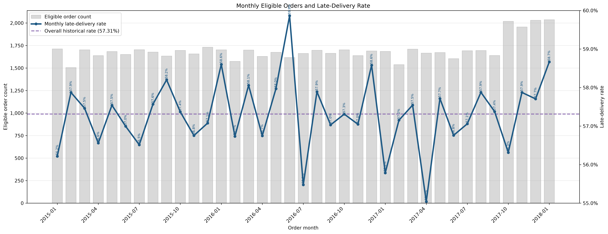
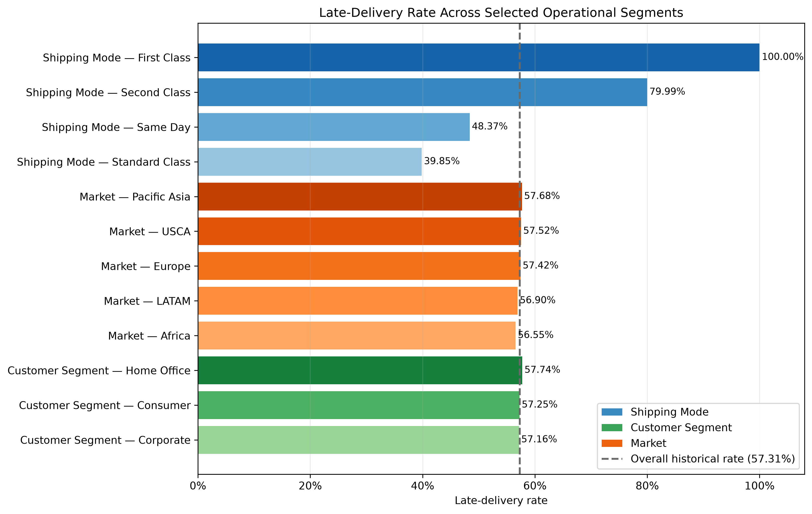
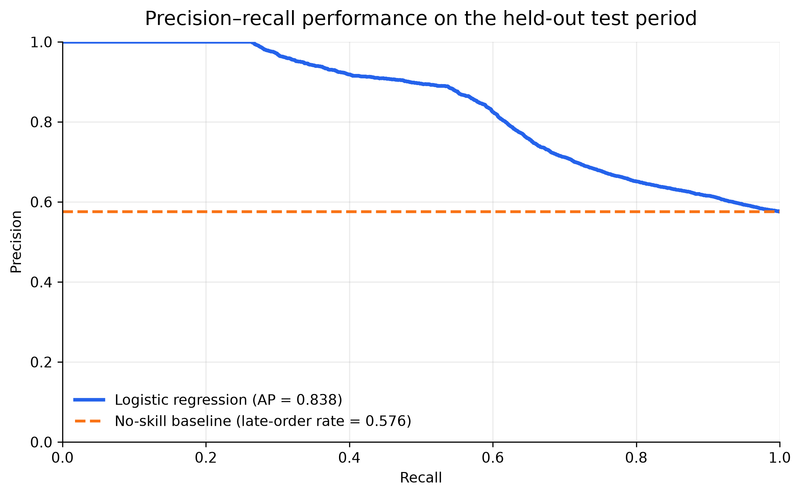

# Order Delivery Risk Analytics

An end-to-end portfolio case study that uses historical order data to identify late-delivery patterns, rank orders by relative risk, and translate limited review capacity into a practical decision-support queue.

The project follows a six-stage analytics workflow: **Ask → Prepare → Process → Analyze → Share → Act**. It combines Python, DuckDB SQL, scikit-learn, and Power BI while keeping operational decisions under human control.

> **Portfolio boundary:** This is an independent case study using public proxy data. It does not represent a live deployment, an intervention trial, or the performance of any specific organisation.

## Project at a glance

| Area | Result |
|---|---:|
| Historical scope | 62,897 eligible orders |
| Late orders | 36,048 |
| Historical late-delivery rate | 57.31% |
| Held-out test period | 13,525 later orders across 32 complete weeks |
| Logistic-regression Average Precision | 0.8382 vs 0.5759 baseline |
| Logistic-regression ROC-AUC | 0.7473 vs 0.5000 baseline |
| Recommended pilot capacity | Top 10% of eligible orders |
| Retrospective top-10% result | 1,353 reviews; 17.37% late-order recall; 100.00% precision; 1.74× lift |

The capacity results are retrospective held-out-period results. They support a controlled pilot, not a claim that review activity will prevent late delivery.

## Business problem

A delivery team may not have enough capacity to review every eligible order. The decision problem is therefore:

**How can limited review capacity be directed toward orders with the highest relative late-delivery risk?**

The analysis addresses four questions:

1. **AQ1:** How large and persistent is late delivery?
2. **AQ2:** Which selected operational attributes show the clearest association with late delivery?
3. **AQ3:** Can a simple, interpretable model rank late-delivery risk better than a non-informative baseline?
4. **AQ4:** What changes when review capacity is limited to 5%, 10%, or 20% of eligible orders?

## Key findings

### 1. Late delivery was persistent

- 36,048 of 62,897 eligible orders were late.
- The overall late-delivery rate was **57.31%**.
- Monthly rates stayed between **55.04% and 59.86%**, with no sustained upward or downward trend.



### 2. Shipping Mode showed the clearest observed association

- First Class: **100.00%** late-delivery rate.
- Second Class: **79.99%**.
- Same Day: **48.37%**.
- Standard Class: **39.85%**.
- Customer Segment, Market, and selected order-size measures showed much smaller differences.

These are observed associations and should not be interpreted as causal effects.



### 3. Logistic regression improved held-out risk ranking

The model was trained on earlier complete weeks and evaluated on a later 32-week holdout period.

| Metric | Dummy baseline | Logistic regression |
|---|---:|---:|
| Average Precision | 0.5759 | 0.8382 |
| ROC-AUC | 0.5000 | 0.7473 |

The score is used for relative prioritisation, not as certainty about an individual order.



### 4. Capacity created a coverage-efficiency trade-off

| Capacity | Orders reviewed | Late-order recall | Review precision | Lift |
|---|---:|---:|---:|---:|
| 5% | 677 | 8.69% | 100.00% | 1.74× |
| 10% | 1,353 | 17.37% | 100.00% | 1.74× |
| 20% | 2,705 | 33.02% | 95.08% | 1.65× |

The top-10% queue was selected as a practical pilot starting point: it captured more late orders than the 5% scenario without the doubled workload and lower precision of the 20% scenario.

## Recommendation

Run a controlled pilot that reviews the **top 10% of eligible orders ranked by predicted late-delivery risk**.

The pilot should:

- generate a highest-risk-first queue at a regular review cadence;
- keep operational decisions with human reviewers;
- track eligible orders, queued orders, completed reviews, and actions taken;
- calculate live precision, recall, and lift after delivery outcomes become available; and
- retain, adjust, or pause the capacity only after several complete review cycles.

## Analytical approach

1. Removed direct identifiers, credential-related fields, and detailed location fields from downstream analytical outputs.
2. Excluded cancelled shipments from delivery-timeliness analysis.
3. Aggregated order-item records to one row per eligible order.
4. Created a continuous complete-week sequence for time-aware evaluation.
5. Used DuckDB SQL for historical KPI and segment analysis.
6. Restricted model predictors to information available at order creation.
7. Compared logistic regression with a dummy baseline on a later temporal holdout.
8. Ranked held-out orders by predicted risk and simulated 5%, 10%, and 20% capacity limits.
9. Communicated the validated evidence through Power BI, presentation slides, and an Act-stage handover brief.

## Tools

| Tool | Project use |
|---|---|
| Python / pandas / NumPy | Data preparation, validation, feature preparation, and scenario analysis |
| DuckDB SQL | Historical KPIs, trends, and segment comparisons |
| scikit-learn | Dummy baseline, preprocessing pipeline, logistic regression, and evaluation |
| Matplotlib | Analytical figures and model-evaluation visuals |
| Power BI | Decision-facing delivery performance and review-capacity dashboard |
| Power Query / DAX | Dashboard preparation and validated business measures |
| Jupyter Notebook | Reproducible analysis workflow and documentation |

## Project workflow

| Stage | Notebook | Purpose |
|---|---|---|
| Ask | [`00_define_problems.ipynb`](notebooks/00_define_problems.ipynb) | Define the business problem, decision users, analytical questions, and success measures |
| Prepare | [`01_prepare_data_readiness.ipynb`](notebooks/01_prepare_data_readiness.ipynb) | Assess source suitability, schema, grain, privacy boundaries, and readiness |
| Process | [`02_process_data_cleaning_and_validation.ipynb`](notebooks/02_process_data_cleaning_and_validation.ipynb) | Clean, validate, aggregate, and save analysis-ready datasets |
| Analyze | [`03_analyze_delivery_risk_and_workload.ipynb`](notebooks/03_analyze_delivery_risk_and_workload.ipynb) | Calculate historical patterns, evaluate risk ranking, and simulate capacity scenarios |
| Share | [`04_share_findings_and_recommendations.ipynb`](notebooks/04_share_findings_and_recommendations.ipynb) | Translate validated findings into a dashboard and presentation story |
| Act | [`05_act_controlled_pilot_and_handover.ipynb`](notebooks/05_act_controlled_pilot_and_handover.ipynb) | Define the controlled pilot, monitoring plan, responsibility boundary, and handover |

## Main deliverables

- **Main analysis:** [`03_analyze_delivery_risk_and_workload.ipynb`](notebooks/03_analyze_delivery_risk_and_workload.ipynb)
- **Power BI dashboard:** [`delivery_risk_analysis_dashboard.pbix`](powerbi/delivery_risk_analysis_dashboard.pbix)
- **Presentation:** [`04_share_presentation.pptx`](presentation/04_share_presentation.pptx)
- **Act handover brief:** [`05_act_controlled_pilot_and_handover.docx`](reports/05_act_controlled_pilot_and_handover.docx)
- **Validated figures and tables:** [`reports/analyze/`](reports/analyze/)

## Repository structure

```text
.
├── data/
│   ├── raw/                  # Source files are not published
│   └── processed/            # Privacy-safe analysis-ready inputs
├── notebooks/                # Ask-to-Act project workflow
├── powerbi/                  # Final Power BI dashboard
├── presentation/             # Final presentation with speaker notes
├── reports/
│   ├── analyze/figures/      # Saved analytical visuals
│   ├── analyze/tables/       # Saved evidence and scenario outputs
│   └── 05_act_...docx        # Final action and handover brief
├── .gitignore
├── requirements.txt
└── README.md
```

## Reproduce the analysis

### 1. Create the Python environment

```bash
python -m venv .venv
```

Windows PowerShell:

```powershell
.\.venv\Scripts\Activate.ps1
```

macOS or Linux:

```bash
source .venv/bin/activate
```

Install the required packages:

```bash
python -m pip install --upgrade pip
pip install -r requirements.txt
```

Start Jupyter:

```bash
jupyter lab
```

### 2. Choose the reproduction route

**Main-analysis route:** The privacy-safe processed inputs are included. Open and run `03_analyze_delivery_risk_and_workload.ipynb` to reproduce the analysis and saved outputs.

**Full-workflow route:** Download Version 5 of the two source CSV files and place them in `data/raw/`:

- `DataCoSupplyChainDataset.csv`
- `DescriptionDataCoSupplyChain.csv`

Then run the notebooks in numerical order from `00` to `05`. The Ask, Share, and Act notebooks are primarily documentation; the Prepare, Process, and Analyze notebooks contain the executable analytical workflow.

## Data source and privacy

The project uses:

> Constante, F., Silva, F., & Pereira, A. (2019). *DataCo SMART SUPPLY CHAIN FOR BIG DATA ANALYSIS* (Version 5). Mendeley Data. [https://doi.org/10.17632/8gx2fvg2k6.5](https://doi.org/10.17632/8gx2fvg2k6.5)

The source is published under the [CC BY 4.0 licence](https://creativecommons.org/licenses/by/4.0/).

The raw main CSV is not included in this repository because it contains direct identifiers, credential-related fields, addresses, and detailed location fields. The included processed tables exclude those fields and retain only the variables required for the portfolio analysis.

## Limitations

- The dataset is historical public proxy data and may not reflect current operating conditions.
- Associations do not establish causal relationships.
- The logistic-regression model was evaluated on one temporal holdout period.
- The analysis does not compare a broad range of tuned models.
- The capacity simulation assumes a fixed highest-risk-first queue and does not model wider operational constraints.
- The project does not demonstrate that reviewing an order prevents late delivery or produces financial benefit.

## Status

The portfolio analysis is complete. A real organisation would still need to approve, operate, and prospectively evaluate the proposed pilot before any wider adoption.
